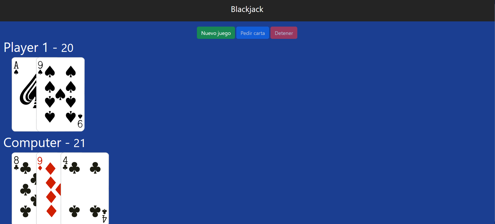

# simple-blackjack-game
Un simple juego de blackjack o 21 depende de como lo llames.
El juego se basa en que debes llegar a los 21 puntos al darle a "pedir cartas" todas estas al azar. También puedes detenerte antes de llegar a 21 y sea el turno de la PC pero corres el riesgo de que la PC gane... o no, todo depende de tu suerte.

El juego se hizo con Vanilla JS, html y un poco de css, tambien se utilizó underscore. 

## Imagen y Livepreview
->> [Live preview](https://chrisvd9.github.io/simple-blackjack-game/) <<-

